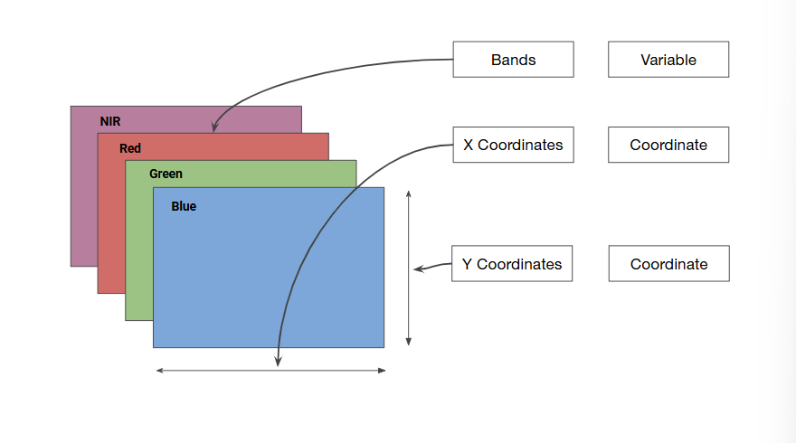
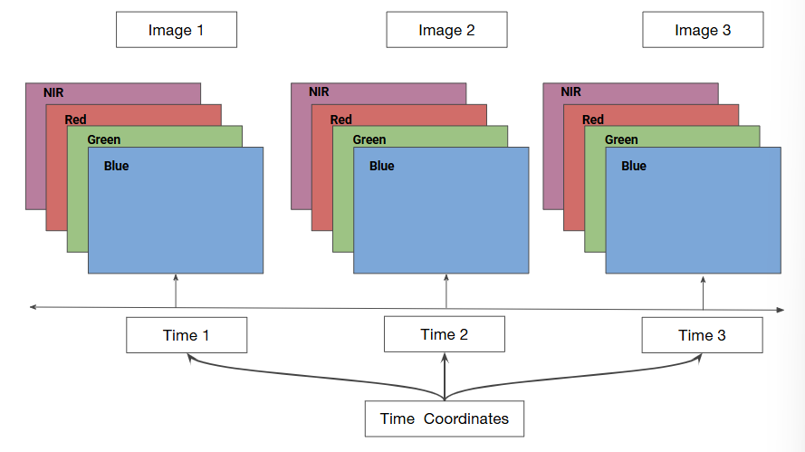
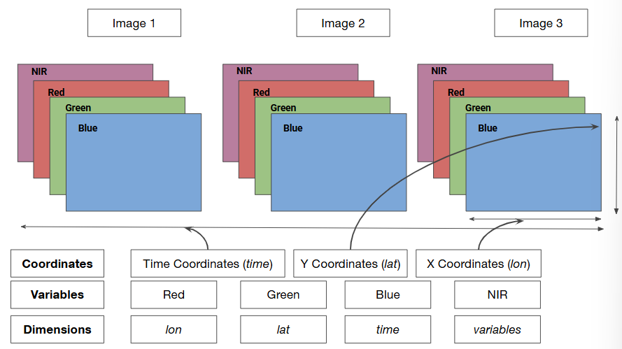

# Cloud Native Geospatial Basics

## Cloud Native Remote Sensing

Traditional remote sensing methods require **downloading and processing individual scenes locally**.

Modern cloud-based approaches enable the use of **analysis-ready data hosted in the cloud** that can be **analyzed by many machines in parallel**.

Development of new data formats and advances in open-source technologies now allows us to build cloud-native geospatial workflows that are **open, scalable, and cloud-agnostic**.

## Principles of Cloud Native Geospatial

1. ### Co-located data and computation

> Maximize the efficiency by location the data close to compute resources

2. ### Analysis-ready data

> Provide datasets in formats that can be streamed and used directly

3. ### Lazy loading (or deferred execution)

> Compute the results only when required

4. ### Distributed (parallel) computation

> Divide the computation tasks into smaller chunks and distribute them over a pool of compute resources

## Key Open-Source Technologies

1. ### Cloud-Optimized GeoTiffs (COGs)

> - Allows streaming specific parts of images directly without downloading the entire file
> - Extends a regula GeoTiff file by adding overviews and a header

2. ### Spatio-Temporal Asset Catalogs (STAC)

> - An open standard to describe and query geospatial data
> - Ecosystem of tools and APIs to query any catalog of geospatial data

3. ### XArray

> - Allows processing multidimensional gridded rasters easily with built-in functions for time-series analysis
> - Orders of magnitude faster than alternatives (e.g., `rasterio`, `terra`, etc.)
> - Growing ecosystem (`rioxarray`, `xr-spatial`, `xr-scipy`, `XEE`, etc.)

4. ### Dask

> - Python library to run your computation in parallel across many machines
> - Built-in support for many Python libraries (`pandas`, `scikit-learn`, `xarray`, etc.)
> - Allows you to run your code on any cluster (laptop, local cluster, cloud cluster, etc.)

5. ### Jupyter

> - Web-based interactive development environment
> - Support for deploying custom computing environments for multiple users

## XArray

### What is XArray?

XArray is a Python package for working with multidimensional arrays. It supports vectorized operations on arrays, resulting in magnitudes of faster processing over iteration.

It is particularly suited for working with multi-band and/or time-series rasters (earth observation and climate datasets).

XArray integrates tightly with `dask`, which allows one to scale raster data processing using parallel computing. It is also at the center of a fast-evolving ecosystem around spatial extensions (`rioxarray`, `xarray-spatial`, `xr-scipy`, etc.).

### Basic Terminology

- #### Variables

> This is similar to a band in a raster dataset. Each variable contains an array of values.

- #### Dimensions

> This is similar to the number of array axes. A grid of pixels (lat and lon) at multiple time internals with multiple variables is a 4D dataset.

- #### Coordinates

> These are the labels for values in each dimension. We have labels for lat, lon, and time.

- #### Attributes

> This is the metadata associated with the dataset.

Below is the diagram for a multi-band raster data at a single time interval.

Let's expand the example to include a time-series of images:

For this time-series of multi-band images, the  `dimensions` are: lon, lat, time, and variables. The `variables` correspond to the bands of each image (blue, green, red, and NIR), while the rest of the dimensions are `coordinates` indicating location across space (lat and lon) and time.

